# Image-Segmentation
 - Image segmentation means that we can group similar pixels together and give these grouped pixels the same label. The grouping problem is a clustering problem. We used K-means and spectral clustering on the Berkeley Segmentation Benchmark.
- We will talk about each technique and the results of the evaluation using F-measures and Conditional Entropy.

It's a university project for Pattern Recognition at Faculty of Engineering, Alexandria University. Computer and Communication Program.

<br>

## FIND COLAB LINK FOR THE PROJECT.
https://colab.research.google.com/drive/13EsG-s_NrtyYGUhKPM45AKwPfEHGYze5?usp=sharing

## Before running!
    1. Download BSR.zip, which includes the 50 images with their truth ground images.

<br>


# Steps
- Below we will show the needed steps to achieve the goal of the assignment.

## 1. Download the Dataset.
- The dataset contains two folders of images, the original images and the ground truth images which are saved in matlab file format. Each image has 5 ground truth segmentation that will be used later for evaluations. We worked on 50 images with different categories and sizes.

## 2. Visualize the image and the ground truth segmentation.
- display an image with its associated ground truth segmentation.
- display an image with its associated ground truth contour segmentation.
<p align="center">
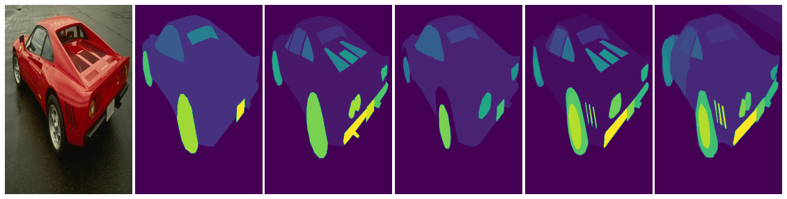
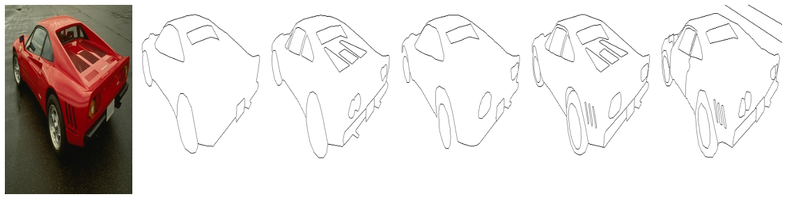
</p>

## 3. Segmentation using K-means
- Every image pixel is a feature vector of 3-dimension {R, G, B}.

Steps:
 - A. We will change the K of the K-means algorithm between {3,5,7,9,11} clusters. that will produce different segmentations and will save them as colored images.         Every color represents a certain group (cluster) of pixels.
 - B. We will evaluate the result segmentation using F-measure, Conditional Entropy for image I with M available ground-truth segmentations.
 - C. Display good results and bad results for every configuration in A, B.

### Sample output
```
 ** Average fmeasure for each K **
[0.65364406 0.52427345 0.48359772 0.42858945 0.39952321]
 ** Average entropy for each K **
[0.40142372 0.34338245 0.32296092 0.31982477 0.28262732]
```
<p align="center">
 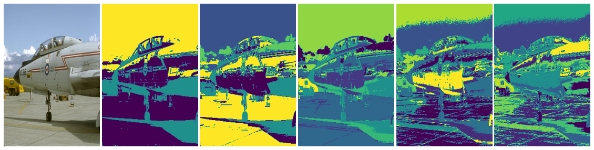
</p>

```
 ** Average fmeasure for each K **
[0.42675117 0.37018466 0.37081968 0.33621452 0.32035279]
 ** Average entropy for each K **
[0.82823465 0.78931538 0.72647158 0.69597183 0.68292893]
```
<p align="center">
 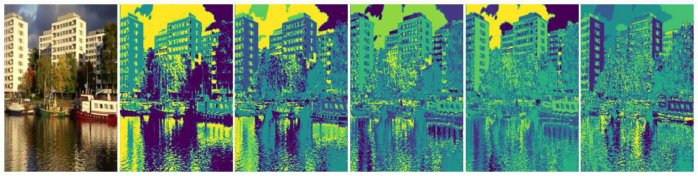
</p>

## 4. Big Picture
- In this section we will compare between ground truth images and the result of k-means and the spectral clustering techniques.

### A. K-means vs Ground Truth
- Select a set of five images and display their corresponding ground truth against your segmentation results using K-means at K=5.

<p align="center">
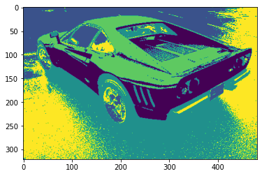
<p align="center">Segmentation results for random image using K-means at k = 5.</p> 

<p align="center">Image corresponding ground truth.</p>
</p>

<p align="center">
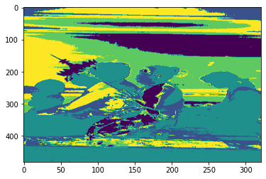
<p align="center">Segmentation results for random image using K-means at k = 5.</p> 
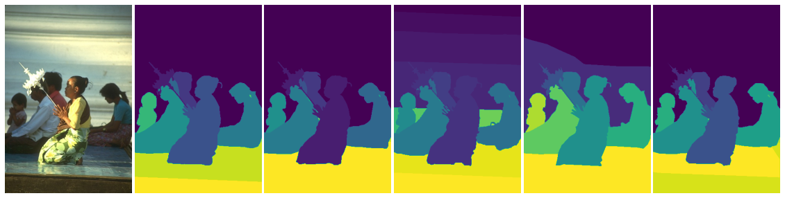
<p align="center">Image corresponding ground truth.</p>
</p>

### B. Spectral Clustering vs Real image.
- Select the five images and display their corresponding ground truth against your segmentation results using Normalized-cut for the 5- NN graph, at K=5.
<p align="center">
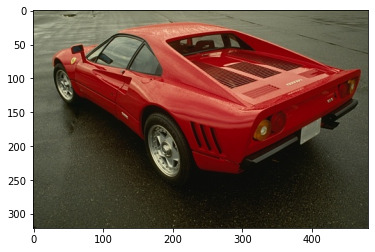
<p align="center">Real image</p> 
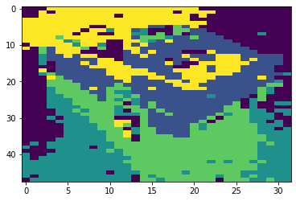
<p align="center">Segmentation results for random image using Normalized-cut for the 5- NN graph, at k = 5. With 10% of it's orginal size</p>
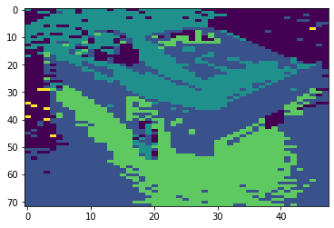
<p align="center">Segmentation results for random image using Normalized-cut for the 5- NN graph, at k = 5. With 10% of it's orginal size</p>
</p>

### C. Spectral Clustering vs K-means vs Real image.
- Select five images and contrast your segmentation results using Normalized-cut for the 5-NN graph, at K=5 versus using K- means at K=5.
<p align="center">

<p align="center">Random Real image</p> 
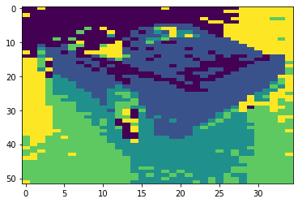
<p align="center">Segmentation results for random image using Normalized-cut for the 5- NN graph, at k = 5. With 11% of it's orginal size</p>
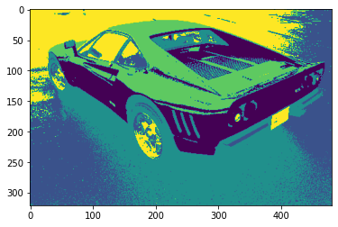
<p align="center">Segmentation results for random image using K-means at k = 5.</p>
</p>

<p align="center">
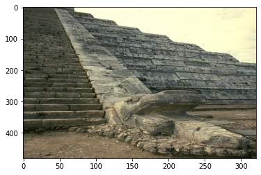
<p align="center">Random Real image</p> 
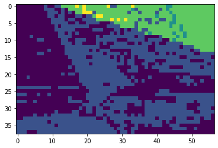
<p align="center">Segmentation results for random image using Normalized-cut for the 5- NN graph, at k = 5. With 12% of it's orginal size</p>
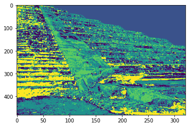
<p align="center">Segmentation results for random image using K-means at k = 5.</p>
</p

## 5. Extra

<p align="center">


<p align="center">Some of the content in the Courses and Departments Table.</p>
</p>
